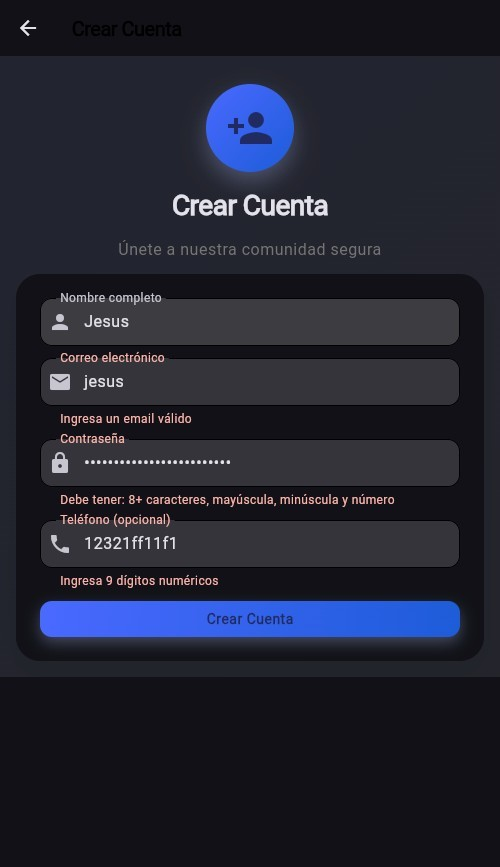

# Examen Unidad II - Validaciones en Flutter

## Información General

| Campo | Dato |
|-------|------|
| **Curso** | Soluciones Móviles II (Móviles II) |
| **Nombre completo del alumno** | Jesus H. Escalante Alanoca |
| **Código de estudiante** | 2015050641 |
| **Fecha** | 02/06/2026 |
| **URL del repositorio público** | https://github.com/JesusEscalante/SM2_EXAMEN_VALIDACIONES.git |

---

### Pantalla seleccionada
Se implementó/adaptó el formulario de **[SM2_EXAMEN_VALIDACIONES\Aplicacion\lib\screens\register_screen.dart (Crear Cuenta)]**.

### Estructura del formulario
- Se utilizó el widget `Form` con un `GlobalKey<FormState>` para gestionar el estado de validación.
- Cada campo es un `TextFormField` (a través del widget personalizado `AuthTextField` o directamente).
- Las validaciones se ejecutan al presionar el botón de envío mediante `_formKey.currentState!.validate()`.
- Los mensajes de error se muestran en texto rojo debajo de cada campo (comportamiento nativo de Flutter).


## Detalle de la Implementación

## Cumplimiento de los 3 Criterios de Aceptación (CA)

| CA | Requisito | Implementación | Línea | Estado |
|----|-----------|----------------|-------|--------|
| **CA1** | `GlobalKey<FormState>` | `final _formKey = GlobalKey<FormState>();` | 17 | ✅ |
| **CA1** | Widget `Form` | `child: Form(key: _formKey, ...)` | 115-116 | ✅ |
| **CA1** | `validate()` al enviar | `if (_formKey.currentState!.validate())` | 27 | ✅ |
| **CA1** | Validadores con error nativo | `validator: (value) { return 'error'; }` | 158-162, 171-179, 188-196, 204-210 | ✅ |
| **CA2** | RegExp Correo electrónico | `RegExp(r'^[^@\s]+@[^@\s]+\.[^@\s]+$')` | 175 | ✅ |
| **CA2** | RegExp Contraseña segura | `RegExp(r'^(?=.*[a-z])(?=.*[A-Z])(?=.*\d).{8,}$')` | 192-194 | ✅ |
| **CA3** | `keyboardType` email | `keyboardType: TextInputType.emailAddress` | 169 | ✅ |
| **CA3** | `keyboardType` phone | `keyboardType: TextInputType.phone` | 202 | ✅ |
| **CA3** | Botón "ojo" contraseña | `obscureText: !_passwordVisible` + `_passwordVisible` | 23, 186 | ✅ |
| **CA3** | Simulación 2 segundos | `Future.delayed(Duration(seconds: 2))` | 29-35 | ✅ |
| **CA3** | `CircularProgressIndicator` | `child: authService.isLoading ? CircularProgressIndicator() : Text(...)` | 253-261 | ✅ |

---

## Evidencia de Cumplimiento

### Correo Electronico:

```dart
AuthTextField(
  label: 'Correo electrónico',
  icon: Icons.email,
  keyboardType: TextInputType.emailAddress,
  controller: _emailController,
  validator: (value) {
    if (value == null || value.isEmpty) {
      return 'Por favor ingresa tu email';
    }
    final emailRegex = RegExp(r'^[^@\s]+@[^@\s]+\.[^@\s]+$');
    if (!emailRegex.hasMatch(value)) {
      return 'Ingresa un email válido';
    }
    return null;
  },
),
```
### Contraseña:

```dart
AuthTextField(
label: 'Contraseña',
icon: Icons.lock,
obscureText: !_passwordVisible,  // MODIFICADO: usa la variable
controller: _passwordController,
validator: (value) {
    if (value == null || value.isEmpty) {
    return 'Por favor ingresa tu contraseña';
    }
    // MODIFICADO: RegExp para contraseña segura
    final passwordRegex = RegExp(
    r'^(?=.*[a-z])(?=.*[A-Z])(?=.*\d).{8,}$'
    );
    if (!passwordRegex.hasMatch(value)) {
    return 'Debe tener: 8+ caracteres, mayúscula, minúscula y número';
    }
    return null;
},
),
const SizedBox(height: 12),
```
### Telefono (opcional):

```dart
AuthTextField(
label: 'Teléfono (opcional)',
icon: Icons.phone,
keyboardType: TextInputType.phone,
controller: _phoneController,
validator: (value) {
    if (value == null || value.isEmpty) return null;
    // 📱 MODIFICADO: 9 dígitos exactos (celular Perú)
    final phoneRegex = RegExp(r'^\d{9}$');
    if (!phoneRegex.hasMatch(value)) {
    return 'Ingresa 9 dígitos numéricos';
    }
    return null;
},
),
```

